# Order Flow Activity Diagram

This diagram shows the complete flow of an order through the trading engine service from ingestion to execution.

```mermaid
flowchart TD
    Start([Order JSON via ZMQ PULL<br/>tcp://127.0.0.1:5601]) --> RecvThread

    subgraph OrderReceiverThread["Order Receiver Thread (Core 2, SCHED_FIFO)"]
        RecvThread[ZMQ Non-blocking Recv]
        RecvThread --> CheckMsg{Message<br/>Received?}
        CheckMsg -->|No| RecvThread
        CheckMsg -->|Yes| ParseOrder[Parse JSON to ExecParsed<br/>parse_execution_order_hft]
        
        ParseOrder --> AllocOrder[Allocate HFTExecutionOrder<br/>from Memory Pool]
        AllocOrder --> PoolCheck{Pool<br/>Available?}
        PoolCheck -->|No| LogPoolErr[Log Pool Exhaustion<br/>Increment Stats] --> RecvThread
        PoolCheck -->|Yes| FillOrder[Fill Order Fields<br/>Copy Tags/Params to FlatMap]
        
        FillOrder --> RecordTS[Record Ingestion Timestamp<br/>get_current_time_ns_hft]
        RecordTS --> Process[process_execution_order_hft]
    end

    subgraph ProcessingLogic["Order Processing Logic (Same Thread)"]
        Process --> ActionHash[Hash Action String<br/>FNV-1a Hash]
        ActionHash --> Dispatch{Action Type?}
        
        Dispatch -->|Place| CheckDupe[Check processed_orders_<br/>Deduplication]
        CheckDupe --> IsDupe{Already<br/>Processed &<br/>Pending?}
        IsDupe -->|Yes| LogDupe[Log Duplicate] --> Done1([Return])
        IsDupe -->|No| PlaceOrder[place_cex_order_hft]
        
        Dispatch -->|Cancel| CancelOrder[cancel_cex_order_hft]
        Dispatch -->|Replace| ReplaceOrder[replace_cex_order_hft]
        Dispatch -->|Unknown| LogUnknown[Log Unknown Action] --> Done2([Return])
    end

    subgraph PlaceFlow["Place Order Flow"]
        PlaceOrder --> ValidatePlace[Validate Fields<br/>- symbol, side, price, size<br/>- category inference<br/>- symbol normalization]
        ValidatePlace --> PlaceValid{Valid?}
        PlaceValid -->|No| SendReject1[send_rejection_report_hft] --> Done3([Return])
        
        PlaceValid -->|Yes| CheckStopOrder{Stop Order?}
        CheckStopOrder -->|Yes| MapStopType[Map stop → market<br/>stop_limit → limit<br/>Set triggerPrice/Direction]
        CheckStopOrder -->|No| CheckReduceOnly
        MapStopType --> CheckReduceOnly
        
        CheckReduceOnly{Reduce Only<br/>+ Spot?}
        CheckReduceOnly -->|Yes| SendReject2[Reject: reduce_only<br/>not allowed on spot] --> Done4([Return])
        CheckReduceOnly -->|No| GetAdapter[VenueRouter::get_adapter<br/>Normalize venue key]
        
        GetAdapter --> AdapterFound{Adapter<br/>Exists?}
        AdapterFound -->|No| SendReject3[Reject: venue not found] --> Done5([Return])
        AdapterFound -->|Yes| BuildReq[Build OrderRequest<br/>Map fields, params, tags]
        
        BuildReq --> AdapterPlace[adapter->place_order]
        AdapterPlace --> PlaceResp{Success?}
        PlaceResp -->|No| SendReject4[send_rejection_report_hft<br/>Include reason] --> Done6([Return])
        PlaceResp -->|Yes| CachePending[Insert to pending_orders_<br/>Cache order metadata]
        CachePending --> MarkProcessed[Mark in processed_orders_]
        MarkProcessed --> SendAccept1[send_acceptance_report_hft] --> Done7([Return])
    end

    subgraph CancelFlow["Cancel Order Flow"]
        CancelOrder --> ResolveCancelID[Resolve cancel_cl_id_to_cancel<br/>from request or tags]
        ResolveCancelID --> CheckPending1{In<br/>pending_orders_?}
        CheckPending1 -->|No| SendReject5[Reject: order not found<br/>or already terminal] --> Done8([Return])
        CheckPending1 -->|Yes| GetSymbol[Get symbol/exchId<br/>from pending cache]
        
        GetSymbol --> GetAdapter2[VenueRouter::get_adapter]
        GetAdapter2 --> AdapterCancel[adapter->cancel_order]
        AdapterCancel --> CancelResp{Success?}
        
        CancelResp -->|Order Not Found| IdempotentOK[Treat as Success<br/>Idempotent Handling]
        IdempotentOK --> PubSynthetic[Publish Synthetic<br/>Canceled Report] --> Done9([Return])
        
        CancelResp -->|Other Error| SendReject6[send_rejection_report_hft] --> Done10([Return])
        CancelResp -->|Success| SendAccept2[send_acceptance_report_hft] --> Done11([Return])
    end

    subgraph ReplaceFlow["Replace Order Flow"]
        ReplaceOrder --> ResolveReplaceID[Resolve replace_cl_id_to_replace]
        ResolveReplaceID --> CheckPending2{In<br/>pending_orders_?}
        CheckPending2 -->|No| SendReject7[Reject: order not found] --> Done12([Return])
        CheckPending2 -->|Yes| InferNewParams[Infer new price/size<br/>from tags or fields]
        
        InferNewParams --> GetAdapter3[VenueRouter::get_adapter]
        GetAdapter3 --> AdapterModify[adapter->modify_order]
        AdapterModify --> ModifyResp{Success?}
        ModifyResp -->|No| SendReject8[send_rejection_report_hft] --> Done13([Return])
        ModifyResp -->|Yes| SendAccept3[send_acceptance_report_hft] --> Done14([Return])
    end

    subgraph AdapterLayer["Exchange Adapter Layer (IExchangeAdapter)"]
        AdapterPlace --> ConnectorPlace[Connector Framework<br/>e.g. HyperliquidPerpetualConnector]
        AdapterCancel --> ConnectorCancel[Connector cancel]
        AdapterModify --> ConnectorModify[Connector modify]
        
        ConnectorPlace --> RestAPI[REST API Call<br/>Boost.Beast HTTPS]
        ConnectorCancel --> RestAPI
        ConnectorModify --> RestAPI
        
        RestAPI --> Exchange[Exchange API<br/>e.g. Hyperliquid]
        Exchange --> RestResp[REST Response]
        
        RestResp --> ParseResp[Parse Response<br/>Extract exchange_order_id]
        ParseResp --> OrderTracker[ClientOrderTracker<br/>Create InFlightOrder]
        OrderTracker --> UserStream[User Stream WebSocket<br/>Async Order Updates]
    end

    subgraph AsyncCallbacks["Async Callbacks (From Adapter)"]
        UserStream --> OrderUpdate[Order Update Event<br/>on_order_update_hft]
        UserStream --> FillEvent[Fill Event<br/>on_fill_hft]
        
        OrderUpdate --> CheckKnown{Order in<br/>pending_orders_?}
        CheckKnown -->|No| LazyRehydrate[Lazy Rehydration<br/>query_order from adapter]
        LazyRehydrate --> InsertLazy[Insert to pending_orders_]
        InsertLazy --> NormalizeStatus
        CheckKnown -->|Yes| NormalizeStatus[Normalize Status<br/>utils::normalize_report_status]
        
        NormalizeStatus --> MapReason[Map Reason Code<br/>DefaultReasonMapper or canonical]
        MapReason --> AddVenueTag[Ensure 'venue' tag]
        AddVenueTag --> PubReport[publish_execution_report_hft]
        
        PubReport --> CheckTerminal{Terminal<br/>Status?}
        CheckTerminal -->|Yes| CleanupPending[Remove from pending_orders_]
        CheckTerminal -->|No| KeepPending
        CleanupPending --> UpdateStats1[Update HFTStats] --> CallbackDone1([Callback Done])
        KeepPending --> UpdateStats2[Update HFTStats] --> CallbackDone2([Callback Done])
        
        FillEvent --> ParseFill[Parse Fill Fields<br/>- price, size, fee<br/>- liquidity, exec_id]
        ParseFill --> CopyTags[Copy Tags from Order]
        CopyTags --> NormalizeSymbol[Normalize Symbol<br/>ISymbolMapper to hyphen form]
        NormalizeSymbol --> TagExecType[Tag execution_type<br/>live or external]
        TagExecType --> PubFill[publish_fill_hft]
        PubFill --> UpdateStats3[Update HFTStats] --> CallbackDone3([Callback Done])
    end

    subgraph PublisherLogic["Publishing Logic"]
        PubReport --> SerializeReport[Serialize to JSON<br/>serialize_execution_report<br/>RapidJSON StringBuffer]
        PubFill --> SerializeFill[Serialize to JSON<br/>serialize_fill<br/>RapidJSON StringBuffer]
        
        SerializeReport --> AllocMsg1[Allocate PublishMessage<br/>from Memory Pool]
        SerializeFill --> AllocMsg2[Allocate PublishMessage<br/>from Memory Pool]
        
        AllocMsg1 --> QueueCheck1{Publish Queue<br/>Full?}
        AllocMsg2 --> QueueCheck2{Publish Queue<br/>Full?}
        
        QueueCheck1 -->|Yes| LogQueueFull1[Log Queue Full<br/>Drop Message] --> StatsErr1([Stats Error])
        QueueCheck2 -->|Yes| LogQueueFull2[Log Queue Full<br/>Drop Message] --> StatsErr2([Stats Error])
        
        QueueCheck1 -->|No| PushQueue1[Push to LockFreeSPSCQueue<br/>publish_queue_]
        QueueCheck2 -->|No| PushQueue2[Push to LockFreeSPSCQueue<br/>publish_queue_]
        
        PushQueue1 --> PublisherThread
        PushQueue2 --> PublisherThread
    end

    subgraph PublisherThread["Publisher Thread (Core 3, SCHED_FIFO)"]
        PublisherThread[Pop from publish_queue_<br/>Non-blocking]
        PublisherThread --> MsgAvail{Message<br/>Available?}
        MsgAvail -->|No| AdaptiveSleep[Adaptive Sleep<br/>Based on CPU Mode] --> PublisherThread
        MsgAvail -->|Yes| SendTopic[ZMQ Send Topic Frame<br/>exec.report or exec.fill]
        
        SendTopic --> SendPayload[ZMQ Send Payload Frame<br/>JSON String]
        SendPayload --> ReturnToPool[Return PublishMessage<br/>to Memory Pool]
        ReturnToPool --> IncrementPubStats[Increment Published Count] --> PublisherThread
    end

    SendPayload --> Subscribers([ZMQ Subscribers<br/>tcp://127.0.0.1:5602])

    subgraph StatsThread["Stats Monitoring Thread (Background)"]
        StatsLoop[Every 10 seconds]
        StatsLoop --> CalcRate[Calculate Orders/sec<br/>Reports/sec, Fills/sec]
        CalcRate --> CalcLatency[Calculate Avg/Min/Max<br/>Latency in microseconds]
        CalcLatency --> CheckPools[Check Pool Availability<br/>Orders, Reports, Fills]
        CheckPools --> CheckQueue[Check Queue Usage<br/>Publish Queue Depth]
        CheckQueue --> LogStats[Log Stats via spdlog] --> StatsLoop
    end

    style Start fill:#e1f5ff
    style Subscribers fill:#e1f5ff
    style OrderReceiverThread fill:#fff4e1
    style PublisherThread fill:#fff4e1
    style StatsThread fill:#f0f0f0
    style ProcessingLogic fill:#ffe1e1
    style PlaceFlow fill:#e1ffe1
    style CancelFlow fill:#ffe1f5
    style ReplaceFlow fill:#f5e1ff
    style AdapterLayer fill:#ffffe1
    style AsyncCallbacks fill:#e1ffff
    style PublisherLogic fill:#ffe1e1
```

## Key Observations

### Thread Model
- **Order Receiver Thread**: Pinned to CPU core 2, SCHED_FIFO priority 80
- **Publisher Thread**: Pinned to CPU core 3, SCHED_FIFO priority 80
- **Stats Thread**: Background monitoring, periodic logging

### Lock-Free Data Flow
- Order receiver → Processing happens synchronously in same thread
- Publishing uses lock-free SPSC queue between processing and publisher thread
- Memory pools pre-allocated and warmed at startup

### Critical Path Optimizations
1. **Zero-copy parsing**: Direct string_view parsing without intermediate allocations
2. **FNV-1a hashing**: Compile-time action dispatch
3. **TSC timestamps**: Ultra-fast nanosecond precision timing
4. **Cache-aligned structures**: 64-byte alignment for HFT data structures
5. **Fixed-size strings**: Stack-allocated, no heap fragmentation

### Asynchronous Callbacks
- Order updates and fills arrive via WebSocket user stream
- Lazy rehydration for unknown orders (external fills, manual trades)
- Idempotent cancel handling for already-completed orders

### Error Handling
- Pool exhaustion: Log + drop message
- Queue full: Log + drop message
- Invalid orders: Rejection report with reason code
- Adapter errors: Propagated to rejection reports

### Performance Monitoring
- Atomic counters for all operations
- Min/max/avg latency tracking
- Pool and queue utilization metrics
- Orders/sec, reports/sec, fills/sec rates

## Data Structures Referenced

- `HFTExecutionOrder`: 64-byte aligned, fixed-size fields
- `HFTExecutionReport`: Execution status, reason codes, tags
- `HFTFill`: Fill details with fees and liquidity
- `PublishMessage`: Queue message wrapper
- `LockFreeSPSCQueue<T,8192>`: Single-producer, single-consumer queue
- `MemoryPool<T,N>`: Pre-allocated cache-aligned object pools
- `FlatMap<Key,Val,N>`: Cache-friendly hash map

## ZMQ Messaging

### Input (PULL socket)
- Endpoint: `tcp://127.0.0.1:5601`
- Format: Raw JSON string (ExecutionOrder)

### Output (PUB socket)
- Endpoint: `tcp://127.0.0.1:5602`
- Topics: `exec.report`, `exec.fill`
- Format: Two frames (topic + JSON payload)

## Latency Budget

Based on HFT optimizations, typical latencies:
- **Parse**: ~1-3 μs (JSON → HFTExecutionOrder)
- **Process**: ~0.5-2 μs (action dispatch, validation)
- **Adapter call**: ~5-50 μs (depends on REST API)
- **Serialize + Queue**: ~1-2 μs (RapidJSON + SPSC push)
- **Publish**: ~5-10 μs (ZMQ send)

**Total end-to-end**: ~10-70 μs (excluding network to exchange)
